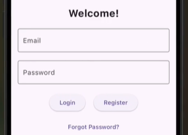
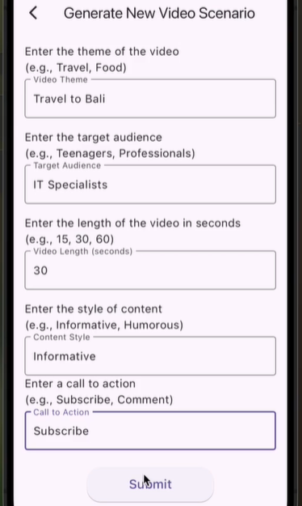
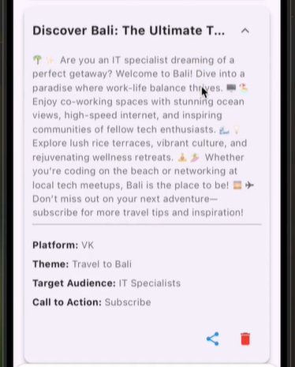

# ScenarioMaker App

<div align="center">

   

</div>

**ScenarioMaker** — это мобильное приложение для креаторов, которое помогает быстро генерировать и управлять сценариями для коротких видеороликов (VK Клипы, YouTube Shorts) с помощью искусственного интеллекта.

## 🚀 Возможности

*   **🔐 Безопасная авторизация** через Firebase Auth.
*   **🤖 Умная генерация сценариев** с использованием OpenAI ChatGPT (запросы выполняются незаметно для пользователя).
*   **☁️ Надежное хранение** всех сценариев в облаке (Cloud Firestore).
*   **📤 Легкий обмен** готовыми сценариями с другими приложениями.
*   **🎯 Специализированные шаблоны** под форматы и требования разных платформ (VK, YouTube).
*   **🗂️ Удобное управление** своими сценариями (просмотр, копирование, удаление).


## 📸 Скриншоты приложения

<div align="center">

| Главный экран | Экран выбора сценария | Генерация сценария | Мои сценарии |
| :---: | :---: | :---: | :---: |
|  |  |  |  |
</div>

## 🛠️ Технологический стек

*   **Фронтенд:** [Flutter](https://flutter.dev/) (Dart) — кроссплатформенная разработка.
*   **Бэкенд и База данных:** [Firebase](https://firebase.google.com/) — комплексное решение от Google.
    *   **Firebase Auth** — для аутентификации пользователей.
    *   **Cloud Firestore** — для хранения сценариев пользователей.
*   **Управление состоянием:** [Flutter Redux](https://pub.dev/packages/flutter_redux) — предсказуемый state-контейнер.
*   **Генерация контента:** [OpenAI ChatGPT API**] — через кастомный прокси-клиент для обхода ограничений.
*   **Дополнительные пакеты:** `http` для сетевых запросов, `share_plus` для функционала "Поделиться", `fluttertoast` для уведомлений и др.

## 📦 Установка и Запуск

Следуйте этим шагам, чтобы запустить проект локально.

### Предварительные условия

1.  Установите [Flutter SDK](https://docs.flutter.dev/get-started/install).
2.  Убедитесь, что ваше окружение настроено правильно: `flutter doctor`.
3.  Установите IDE (рекомендуется [Android Studio](https://developer.android.com/studio) с плагином Flutter или [VS Code](https://code.visualstudio.com/) с расширением Dart & Flutter).
4.  Аккаунт в [Firebase Console](https://console.firebase.google.com/).

### Настройка Firebase

1.  Создайте новый проект в [Firebase Console](https://console.firebase.google.com/).
2.  Добавьте в проект Android-приложение (`com.example.scenariomakerapp`) и/или iOS-приложение.
3.  Скачайте файлы конфигурации (`google-services.json` для Android и `GoogleService-Info.plist` для iOS) и поместите их в соответствующие папки вашего Flutter-проекта (`android/app/` и `ios/Runner/` соответственно).
4.  В консоли Firebase включите **Authentication** и добавьте провайдер **Email/Password**.
5.  В консоли Firebase создайте базу данных **Cloud Firestore** в режиме тестового запуска (для начала).

### Настройка Прокси для OpenAI API

1.  Приложение использует кастомный прокси-сервер для доступа к API OpenAI.
2.  Создайте файл `.env` в корне проекта на основе примера `.env.example` и укажите в нем ваш endpoint и ключ для прокси:
    ```bash
    PROXY_API_BASE_URL=your_proxy_server_url_here
    PROXY_API_KEY=your_proxy_api_key_here
    ```
3.  **ВНИМАНИЕ:** Никогда не коммитьте файл `.env` в репозиторий! Он добавлен в `.gitignore`.

### Запуск приложения

1.  Клонируйте репозиторий:
    ```bash
    git clone https://github.com/your-username/scenariomakerapp.git
    cd scenariomakerapp
    ```
2.  Получите все зависимости:
    ```bash
    flutter pub get
    ```
3.  Запустите приложение на эмуляторе или физическом устройстве:
    ```bash
    flutter run
    ```

## 🏗️ Архитектура и Структура проекта

Основная архитектура приложения построена вокруг **Redux** для управления глобальным состоянием.

```
lib/
├── main.dart                 # Точка входа, инициализация Firebase и Store
├── models/                  # Модели данных (User, Scenario, etc.)
├── redux/                   # Redux стейт, actions, reducers, middleware
│   ├── state/
│   ├── actions/
│   └── reducers/
├── services/                # Слой работы с API и Firebase
│   ├── api_service.dart    # Клиент для работы с прокси ChatGPT
│   └── firebase_service.dart
├── ui/                     # Пользовательский интерфейс
│   ├── screens/            # Экраны приложения
│   │   ├── login_screen.dart
│   │   ├── home_screen.dart
│   │   ├── form_screen.dart
│   │   └── library_screen.dart
│   └── widgets/            # Переиспользуемые виджеты
└── utils/                  # Вспомогательные утилиты (constants, helpers)
```

## 📝 Как пользоваться

1.  **Регистрация и Вход:** Запустите приложение, создайте аккаунт или войдите с помощью email и пароля.
2.  **Создание сценария:**
    *   На главном экране выберите платформу (например, "VK Клипы").
    *   Заполните форму: укажите тему, целевую аудиторию, длительность, стиль и призыв к действию.
    *   Нажмите "Submit". Приложение отправит запрос к AI и автоматически сохранит результат в вашу облачную библиотеку.
3.  **Управление сценариями:**
    *   Перейдите на вкладку "Мои сценарии" (иконка флажка внизу).
    *   Просматривайте список всех сохраненных сценариев.
    *   Нажмите "Copy", чтобы скопировать текст сценария в буфер обмена для вставки в другое приложение.
    *   Нажмите на иконку корзины, чтобы безвозвратно удалить сценарий из Firestore.

## 🤝 Разработка

Мы рады вкладу сообщества! Чтобы внести свой вклад:

1.  Форкните проект.
2.  Создайте ветку для вашей фичи (`git checkout -b feature/AmazingFeature`).
3.  Закоммитьте ваши изменения (`git commit -m 'Add some AmazingFeature'`).
4.  Запушьте в ветку (`git push origin feature/AmazingFeature`).
5.  Откройте Pull Request.

Пожалуйста, убедитесь, что ваш код соответствует принятому стилю и проходит все тесты.

## 📄 Лицензия

Этот проект распространяется под лицензией MIT. См. файл `LICENSE` для подробной информации.

## ⚠️ Заявление об ограничении ответственности (Disclaimer)

Это приложение является симулятором и создано в образовательных целях. Оно использует API OpenAI через сторонний прокси-сервер. Ответственность за использование API и соблюдение правил соответствующих сервисов (OpenAI, VK, YouTube) лежит на пользователе. Разработчики не несут ответственности за контент, генерируемый приложением.

---

**Найдете баг или есть идея?** Создайте [issue](https://github.com/your-username/scenariomakerapp/issues) на GitHub!
